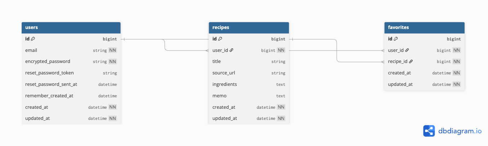

# Recipin'（レシピン） - 「また作りたい」がすぐ見つかる、レシピのストックアプリ

## 1. サービス概要

**SNS・YouTube・レシピサイトで見つけた料理を、レシピ帳のようにアプリに保存して“探す時間”を減らすレシピストックアプリ**
**自分のレシピをストックし、検索・お気に入りで管理できるレシピ記録アプリ**

## 2. サービス画像

## 3. サービスのURL

**https://recipin-app-18eb78477f51.herokuapp.com/**

※ ゲストログインボタンからすぐに試せます
※ 画像はJPEG/PNG形式をご使用ください（HEIC形式は現在サポート対象外）

## 4. サービス

Recipin'（レシピン）は、日々の料理で参考にしたレシピを「自分だけのレシピ帳」としてストックできるWebアプリです。
SNSやYouTube、レシピサイトで見つけたレシピは、後日作ろうと思ったときに「どこで見たか分からない」「保存したはずなのに見つからない」「リンク先が削除されていた」ということがよく起きます。

本アプリでは、**レシピをアプリ内に保存（ストック）**できるだけでなく、参考URLも一緒に登録できるため、後から見返しやすく、迷わず料理に取りかかれます。
また、Webアプリの扱いが苦手な方でも使いやすいように、機能を絞ってシンプルな導線にしています。

## 5. 開発背景

料理をする際、SNS・YouTube・レシピサイトを参考にすることが多い一方で、次回作りたいときにレシピが見つからず、探す時間が発生してしまう課題を感じていました。
さらに、外部サービスの投稿や動画は削除されることもあり、「保存した情報に再度アクセスできない」こともあります。

そこで、外部サービスに依存せず、必要な情報を自分のレシピ帳として残せる仕組みがあれば、日々の料理がもっとスムーズになると考え、Recipin'（レシピン）を開発しました。
また、家族など「Webサービスが得意ではない人」でも迷わず使えることを重視し、最低限の機能に絞ったシンプル設計にしています。

## 6. 機能

### 認証
- ユーザー登録 / ログイン / ログアウト（Devise）
- ゲストログイン（ワンクリック）

### レシピ
- レシピCRUD（作成 / 一覧 / 詳細 / 編集 / 削除）
- 画像アップロード（任意：ActiveStorage）
- 画像未登録時はデフォルト画像を表示
- 参考URL、材料、メモの登録

### 検索
- タイトル / 材料 / メモを対象にキーワード検索（Ransack）

### お気に入り
- お気に入り追加/解除（トグル）
- お気に入り一覧表示

## 7. 主な使用技術

### フロントエンド
- HTML / CSS / JavaScript
- Turbo（標準Rails）

### バックエンド
- Ruby 3.3.10
- Ruby on Rails 7.2.2.1
- PostgreSQL

### 画像保存（ActiveStorage）
- 開発：ローカル保存
- 本番：AWS S3

### インフラ・デプロイ
- Heroku（Web Dyno + PostgreSQL）
- Git / GitHub

## 8. ER図

### テーブル説明

#### users（ユーザー）
- Deviseによる認証情報を管理
- レシピの作成者、お気に入りの所有者

#### recipes（レシピ）
- レシピの基本情報（タイトル、材料、メモ、参考URL）
- user_idで作成者と紐付け
- 画像はActiveStorageで管理（本番環境：AWS S3）

#### favorites（お気に入り）
- usersとrecipesの多対多の中間テーブル
- user_id + recipe_idのユニーク制約で重複を防止

## 9. 今後の展望
### 直近の修正予定
- UIの改善（より迷わない導線・ボタン配置）
- レスポンシブ対応の強化（スマホでさらに使いやすく）
- テスト実装（RSpec）

### 短期的な目標
- 非同期でお気に入り切替（ページリロードなし）
- カテゴリ/タグ機能（和食・洋食・節約などで整理）
- HEIC画像形式のサポート

### 中長期的な目標
- 買い物リスト機能（材料から自動生成）
- 印刷機能実装（紙で見たい人向け）
